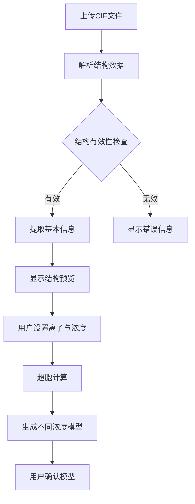
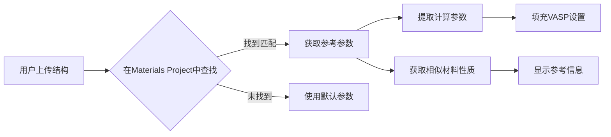

# 电极材料计算设计文档

## 一、界面与用户交互设计

### 1. 文件上传区域

- **支持文件格式**：
  - CIF（Crystallographic Information File）
  - PDB（Protein Data Bank）
  - POSCAR（VASP结构文件）
  - CML（Chemical Markup Language）
  - XYZ坐标文件

- **上传区设计**：
  ```
  +-------------------------------------------+
  |                                           |
  |  拖拽文件到此区域 或 点击此处上传文件     |
  |                                           |
  |  支持格式: .cif, .pdb, .poscar, .xyz, .cml|
  |                                           |
  +-------------------------------------------+
  ```

- **文件预览功能**：
  - 上传后显示结构基本信息（化学式、空间群、晶胞参数）
  - 提供3D可视化预览（使用3Dmol.js或类似库）

### 2. 离子选择与浓度设置区域

- **离子种类选择**：
  ```
  工作离子: [下拉选择框]
  [ ] Li⁺   [ ] Na⁺   [ ] K⁺
  [ ] Mg²⁺  [ ] Ca²⁺  [ ] Al³⁺
  ```

- **浓度设置**：
  ```
  浓度范围设置:
  最小浓度: [  ] mol/L  最大浓度: [  ] mol/L  步长: [  ] mol/L
  
  或者
  
  离子插入比例: 
  最小值: [  ] %  最大值: [  ] %  步数: [  ]
  ```

### 3. 超胞设置区域

- **自动或手动设置**：
  ```
  超胞设置:
  (•) 自动规划   ( ) 手动设置
  
  自动规划时的目标原子数: [100-200] 个原子
  
  手动设置:
  a方向: [  ] 倍   b方向: [  ] 倍   c方向: [  ] 倍
  ```

### 4. 模型预览区域

- **多视图展示**：
  - 原始单元格视图
  - 超胞视图
  - 不同浓度的插入模型预览（带滑块控制切换）
  
- **模型信息显示**：
  ```
  当前模型: Li₀.₅CoO₂ (x=0.5)
  原子数: 200个
  体积: 1234.56 ų
  理论密度: 5.67 g/cm³
  ```

### 5. 计算参数设置区域

- **预设与自定义**：
  ```
  计算精度:
  (•) 快速测试   ( ) 标准精度   ( ) 高精度   ( ) 自定义
  
  VASP参数:
  ENCUT: [400] eV
  EDIFF: [1E-5]
  ISMEAR: [1]
  K点网格: [  ]x[  ]x[  ]
  ```

- **高级参数折叠面板**：
  ```
  [+] 高级参数设置
      LORBIT: [  ]
      ISPIN: [  ]
      LDAU: [  ]
      ...
  ```

### 6. 计算作业设置

- **作业配置**：
  ```
  计算名称: [电极电势计算-LiCoO₂]
  计算资源:
  (•) 自动分配   ( ) 手动设置
  CPU核心数: [  ]   内存: [  ] GB
  预计运行时间: [  ] 小时
  计算完成通知: [✓] 邮件   [ ] 平台消息
  ```

## 二、数据流与处理逻辑

### 1. 结构解析与处理



### 2. 浓度模型生成算法

1. **解析原始晶胞结构**
2. **识别可插入离子位点**
   - 对于Li离子，检查八面体和四面体空隙
   - 计算空位的坐标和可能的插入数量
3. **构建超胞**
   - 基于目标原子数或用户设置扩展单元格
   - 确保超胞足够大以实现所需的浓度梯度
4. **离子插入**
   - 根据指定的浓度范围，生成不同浓度的结构
   - 对于每个浓度，计算需要插入的离子数
   - 随机或有序地在可能位点插入离子
5. **结构优化**
   - 对生成的结构进行初步的几何优化
   - 调整原子位置以减少局部应力

### 3. Materials Project数据集成



## 三、API接口设计

### 1. 结构解析与超胞生成

```typescript
interface StructureParsingRequest {
  file: File;             // 上传的结构文件
  fileFormat: string;     // 'cif', 'poscar', 'pdb', etc.
}

interface StructureParsingResponse {
  success: boolean;
  structure: {
    formula: string;      // 化学式
    spaceGroup: string;   // 空间群
    latticeParams: {      // 晶格参数
      a: number;
      b: number;
      c: number;
      alpha: number;
      beta: number;
      gamma: number;
    };
    volume: number;       // 体积
    atoms: number;        // 原子数
    density: number;      // 密度
    elements: string[];   // 元素组成
    visualizationData: any; // 可视化数据
  };
  error?: string;
}

interface SupercellGenerationRequest {
  originalStructure: any; // 原始结构数据
  method: 'auto' | 'manual';
  targetAtomCount?: number;  // 自动模式下目标原子数
  supercellDimensions?: {    // 手动模式下超胞尺寸
    a: number;
    b: number;
    c: number;
  };
}

interface SupercellGenerationResponse {
  success: boolean;
  supercell: {
    dimensions: {
      a: number;
      b: number;
      c: number;
    };
    atomCount: number;
    volume: number;
    visualizationData: any;
  };
  error?: string;
}
```

### 2. 离子插入模型生成

```typescript
interface IonInsertionRequest {
  supercell: any;         // 超胞结构
  ionType: string;        // 'Li', 'Na', etc.
  concentrationRange: {
    min: number;          // 最小浓度/比例
    max: number;          // 最大浓度/比例
    steps: number;        // 浓度步数
  };
}

interface IonInsertionResponse {
  success: boolean;
  models: Array<{
    concentration: number;  // 离子浓度/比例
    formula: string;        // 对应化学式
    structure: any;         // 结构数据
    atomCount: number;      // 原子数
    visualizationData: any; // 可视化数据
  }>;
  error?: string;
}
```

### 3. Materials Project数据查询

```typescript
interface MaterialsProjectSearchRequest {
  formula: string;        // 化学式
  elements: string[];     // 元素组成
}

interface MaterialsProjectSearchResponse {
  success: boolean;
  matches: Array<{
    mpId: string;         // Materials Project ID
    formula: string;      // 化学式
    structure: any;       // 结构数据
    properties: {
      bandGap: number;    // 带隙
      formationEnergy: number; // 形成能
      volumePerAtom: number;   // 每原子体积
      density: number;    // 密度
      // 其他性质...
    };
    calculationParameters: {
      // VASP参数
      ENCUT: number;
      EDIFF: number;
      ISMEAR: number;
      KPOINTS: number[];
      // 其他参数...
    };
  }>;
  error?: string;
}
```

### 4. 计算作业提交

```typescript
interface CalculationJobRequest {
  name: string;           // 作业名称
  description?: string;   // 作业描述
  models: any[];          // 计算模型列表
  parameters: {
    // VASP计算参数
    ENCUT: number;
    EDIFF: number;
    ISMEAR: number;
    KPOINTS: number[];
    // 其他参数...
  };
  resources: {
    cpuCores: number;     // CPU核心数
    memory: number;       // 内存(GB)
    estimatedTime: number; // 预计时间(小时)
  };
  notifications: {
    email: boolean;       // 邮件通知
    platform: boolean;    // 平台消息通知
  };
}

interface CalculationJobResponse {
  success: boolean;
  jobId: string;          // 作业ID
  queuePosition: number;  // 队列位置
  estimatedStartTime: string; // 预计开始时间
  error?: string;
}
```

## 四、组件设计与交互逻辑

### 1. 电极材料计算工作流组件结构

```jsx
<ElectrodeMaterialWorkflow>
  <StepWizard>
    {/* 步骤1: 结构上传与基本信息 */}
    <StructureUploadStep>
      <FileUploadZone />
      <StructurePreview />
      <StructureInfo />
    </StructureUploadStep>
    
    {/* 步骤2: 离子设置与超胞配置 */}
    <IonConfigurationStep>
      <IonSelector />
      <ConcentrationRangeSelector />
      <SupercellConfigurator />
    </IonConfigurationStep>
    
    {/* 步骤3: 模型生成与预览 */}
    <ModelGenerationStep>
      <ModelList />
      <ModelViewer />
      <ModelDetailPanel />
    </ModelGenerationStep>
    
    {/* 步骤4: 计算参数配置 */}
    <CalculationSetupStep>
      <MaterialsProjectReferencePanel />
      <CalculationParametersForm />
      <ResourceAllocationPanel />
    </CalculationSetupStep>
    
    {/* 步骤5: 提交与确认 */}
    <SubmissionStep>
      <JobSummary />
      <NotificationSettings />
      <SubmitButton />
    </SubmissionStep>
  </StepWizard>
</ElectrodeMaterialWorkflow>
```

### 2. 3D结构可视化组件

```jsx
<StructureViewer>
  <ViewportControls>
    <ZoomControls />
    <RotationControls />
    <StyleSelector />  {/* 球棍模型、空间填充模型等 */}
  </ViewportControls>
  
  <MoleculeViewport />
  
  <ViewerToolbar>
    <AtomVisibilityControls />
    <MeasurementTools />
    <ExportOptions />
  </ViewerToolbar>
  
  <StructureInfoPanel>
    <ElementList />
    <BondInformation />
    <SelectedAtomInfo />
  </StructureInfoPanel>
</StructureViewer>
```

### 3. 参数配置表单

```jsx
<CalculationParametersForm>
  <ParameterPresets>
    <PresetSelector options={['快速', '标准', '高精度', '自定义']} />
  </ParameterPresets>
  
  <CoreParametersSection>
    <NumericInput name="ENCUT" label="平面波截断能" suffix="eV" />
    <NumericInput name="EDIFF" label="电子收敛标准" />
    <DropdownSelect name="ISMEAR" label="展宽方法" />
    <KPointsInput label="K点网格" />
  </CoreParametersSection>
  
  <CollapsibleSection title="高级参数">
    <NumericInput name="LORBIT" label="LORBIT" />
    <DropdownSelect name="ISPIN" label="自旋极化" />
    <SwitchInput name="LDAU" label="+U校正" />
    {/* 更多高级参数 */}
  </CollapsibleSection>
</CalculationParametersForm>
```

## 五、数据存储模型

### 1. 电极电势计算任务模型

```typescript
interface ElectrodeVoltageCalculationTask {
  id: string;             // 任务ID
  userId: string;         // 用户ID
  status: 'draft' | 'queued' | 'running' | 'completed' | 'failed';
  createdAt: Date;        // 创建时间
  startedAt?: Date;       // 开始时间
  completedAt?: Date;     // 完成时间
  
  // 基本信息
  name: string;           // 任务名称
  description?: string;   // 任务描述
  
  // 材料信息
  originalStructure: {
    format: string;       // 文件格式
    formula: string;      // 化学式
    data: any;            // 结构数据
    metadata: any;        // 元数据
  };
  
  // 计算配置
  configuration: {
    ionType: string;      // 离子类型
    concentrationRange: {
      min: number;
      max: number;
      steps: number;
    };
    supercell: {
      method: 'auto' | 'manual';
      targetAtomCount?: number;
      dimensions?: {
        a: number;
        b: number;
        c: number;
      };
    };
    calculationParameters: {
      // VASP参数
      precision: 'low' | 'medium' | 'high' | 'custom';
      customParameters?: Record<string, any>;
    };
    resources: {
      cpuCores: number;
      memory: number;
      estimatedTime: number;
    };
  };
  
  // 计算模型
  models: Array<{
    id: string;           // 模型ID
    concentration: number; // 浓度/比例
    formula: string;      // 化学式
    structure: any;       // 结构数据
    status: 'pending' | 'running' | 'completed' | 'failed';
    computationTime?: number; // 计算时间(秒)
    results?: {
      energy: number;     // 总能量
      volumeChange: number; // 体积变化百分比
      // 其他结果...
    };
  }>;
  
  // 计算结果
  results?: {
    voltageProfile: Array<{
      concentration: number; // 浓度/比例
      voltage: number;     // 电压(V)
    }>;
    averageVoltage: number; // 平均电压(V)
    volumeChanges: number; // 体积变化百分比
    // 其他结果...
  };
  
  // 通知设置
  notifications: {
    email: boolean;
    platform: boolean;
    recipients?: string[]; // 额外接收者邮箱
  };
}
```

### 2. 参考材料数据模型

```typescript
interface ReferenceMaterial {
  id: string;             // 材料ID
  source: 'MaterialsProject' | 'OQMD' | 'AFLOW' | 'custom';
  sourceId?: string;      // 源数据库中的ID
  
  formula: string;        // 化学式
  elements: string[];     // 元素组成
  structure: any;         // 结构数据
  
  properties: {
    bandGap?: number;     // 带隙(eV)
    formationEnergy?: number; // 形成能(eV/atom)
    volumePerAtom?: number;   // 每原子体积(ų)
    density?: number;     // 密度(g/cm³)
    bulkModulus?: number; // 体积模量(GPa)
    // 其他性质...
  };
  
  calculationParameters: {
    // 计算参数
    ENCUT?: number;
    EDIFF?: number;
    ISMEAR?: number;
    KPOINTS?: number[];
    // 其他参数...
  };
  
  // 电池相关性质
  batteryProperties?: {
    voltageVsLi?: number; // 相对锂的电压(V)
    capacityGravimetric?: number; // 比容量(mAh/g)
    capacityVolumetric?: number;  // 体积容量(mAh/cm³)
    diffusionBarrier?: number;    // 扩散势垒(eV)
    // 其他电池性质...
  };
  
  createdAt: Date;        // 创建时间
  updatedAt: Date;        // 更新时间
}
```

## 六、计算流程详细步骤

### 1. 用户交互流程

1. **结构上传**
   - 用户上传CIF或其他格式的结构文件
   - 系统解析文件并提取基本信息
   - 显示3D预览和基本结构信息
   
2. **离子与浓度设置**
   - 用户选择工作离子（如Li+, Na+等）
   - 设置浓度范围或插入比例范围
   - 指定浓度步长或步数
   
3. **超胞配置**
   - 系统推荐最佳超胞尺寸（基于原子数目标）
   - 用户可选择接受推荐或手动设置
   - 预览生成的超胞结构
   
4. **模型生成与检查**
   - 系统生成不同浓度的离子插入模型
   - 用户可预览每个模型的3D结构
   - 用户可检查并调整有问题的模型
   
5. **计算参数配置**
   - 系统自动从Materials Project查询相似材料
   - 基于查询结果推荐计算参数
   - 用户可选择预设或自定义参数
   
6. **资源分配与提交**
   - 系统估算计算资源需求
   - 用户配置作业名称和通知设置
   - 提交计算作业到计算队列

### 2. 后台计算流程

1. **预处理阶段**
   - 对上传的结构进行完整性检查
   - 优化超胞构型
   - 准备VASP输入文件
   
2. **计算阶段**
   - 对每个浓度模型分别执行能量计算
   - 对参考离子结构进行能量计算
   - 实时监控计算进度和收敛情况
   
3. **后处理阶段**
   - 收集各浓度模型的总能量
   - 计算电极电势（使用公式: V = -ΔG/nF）
   - 生成电势-浓度曲线
   
4. **结果分析阶段**
   - 计算平均电极电势
   - 分析体积变化趋势
   - 评估结构稳定性
   - 预测循环性能

### 3. 结果可视化

1. **电压特性**
   - 电压-容量曲线
   - 阶跃电压图
   - 平均电压值表格
   
2. **结构变化**
   - 各浓度下的结构动画
   - 体积变化曲线
   - 键长/键角变化趋势
   
3. **电子结构**
   - 能带结构（可选）
   - 态密度图（可选）
   - 电荷密度分布（可选）

## 七、实现步骤与时间规划

### 第一阶段：基础功能实现（2周）

1. **结构上传与解析功能**（3天）
   - 实现多格式文件上传
   - 结构解析与基本信息提取
   - 3D可视化预览

2. **超胞生成与离子插入功能**（5天）
   - 超胞构建算法
   - 离子位点识别
   - 多浓度模型生成

3. **Materials Project API集成**（3天）
   - 材料搜索接口
   - 参数提取与应用
   - 参考数据展示

4. **基础UI实现**（3天）
   - 表单组件开发
   - 步骤导航
   - 响应式布局

### 第二阶段：高级功能与优化（2周）

1. **高级计算参数配置**（4天）
   - 参数预设功能
   - 高级参数表单
   - 参数验证与提示

2. **3D可视化增强**（3天）
   - 多视图支持
   - 动画效果
   - 测量工具

3. **计算作业管理**（4天）
   - 任务创建与提交
   - 队列管理
   - 结果存储

4. **用户体验优化**（3天）
   - 交互优化
   - 帮助提示
   - 错误处理

### 第三阶段：测试与上线（1周）

1. **单元测试与集成测试**（3天）
2. **用户测试与反馈收集**（2天）
3. **文档编写**（1天）
4. **上线准备与部署**（1天）

## 八、技术栈选择

### 前端技术

- **框架**: React.js
- **UI库**: Ant Design
- **3D可视化**: Three.js + 3Dmol.js
- **图表库**: ECharts
- **状态管理**: Redux Toolkit
- **API通信**: Axios

### 后端技术

- **框架**: Django + Django REST Framework
- **科学计算**: Pymatgen, ASE
- **材料数据库接口**: MPRester (Materials Project API)
- **任务队列**: Celery
- **数据存储**: PostgreSQL + MongoDB (大型结果)

### 计算引擎

- **主要引擎**: VASP (通过API调用)
- **轻量替代**: GPAW (用于快速计算)
- **辅助工具**: Atomate2 (工作流管理) 